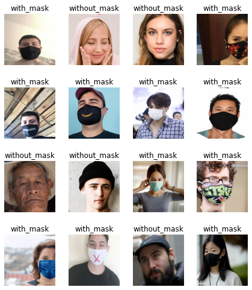
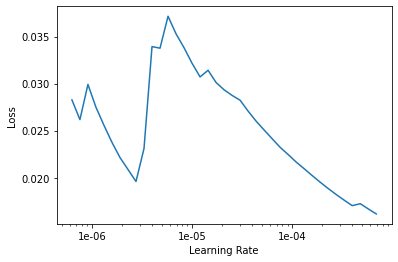
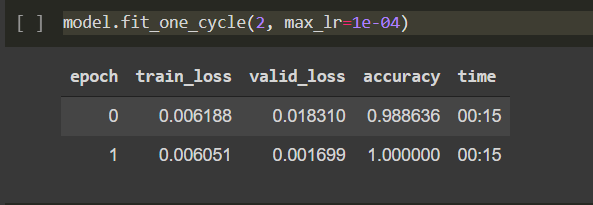
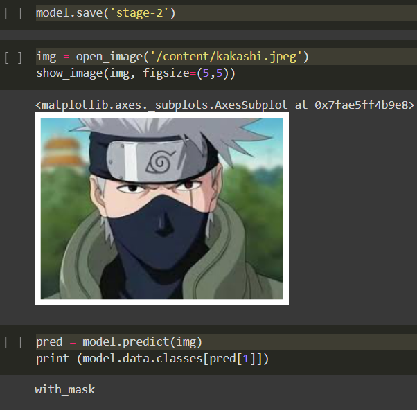

# Mask Recognition 

## Table of contents

- [The challenge](#the-challenge)
  - [Overview](#overview)
- [My process](#my-process)
  - [Built with](#built-with)
  - [Result of classifier](#result-of-classifier)
  - [Future Work](#future-work)
  - [Useful resources](#useful-resources)
- [Author](#author)

## The challenge

Create a Python program to determine the understanding of Convolutional Neural Network, resnet34 and deep learning skills. Handson experience on Jupyter Notebook code.

### Overview

In this project, we have used Convolutional Neural Network to check whether a person is wearing mask or not.

## My process

- First Colored Human Face images wearing mask and without mask Dataset was taken from Kaggle.
- Then images labeled as "with_mask" and "without_mask" were transformed using get_transforms() method. Following random transforms were applied on each image:
  - flip
  - rotation
  - zoom
  - lightning and contrast change
  - symmetric warp of magnitude
  - affine transform

- The labelled dataset was trained using CNN with resnet34 model. The Metric used was accuracy.
- The Learning rate was calculated using "lr_find()" and "recorder.plot()" methods. 

- (Learning Rate Value= 1e-04)
- The training was done on Google Colab with GPU Hardware accelerator. It took around 5 minutes to complete the training.
- The model ended up with a 98% accuracy.

### Built with

- Python 3
- pandas
- fastai

### Result of classifier

### Future Work

- You can save your model in .pkl file, which can be integrated in other webapps or mobile applications.
- It can be installed in CCTV cameras of Hospitals and Microbiology lab to check if a person is wearing a mask or not.
- Below is the link of how to integrate .pkl file using OpenCV.
- [How to integrate .pkl file using OpenCV](https://towardsdatascience.com/how-to-deploy-a-pre-trained-keras-model-with-opencv-and-flask-86c9dab76a9c)

### Useful resources

- [Face mask Dataset](https://www.kaggle.com/datasets?search=face+mask) 
- [Fastai Documentation](https://docs.fast.ai/) - This helped me for understanding all concepts of fastai library. This is the top of my list for machine learning development.

## Author

- [Abhinav Shukla](Programmer,TCS,Pune)